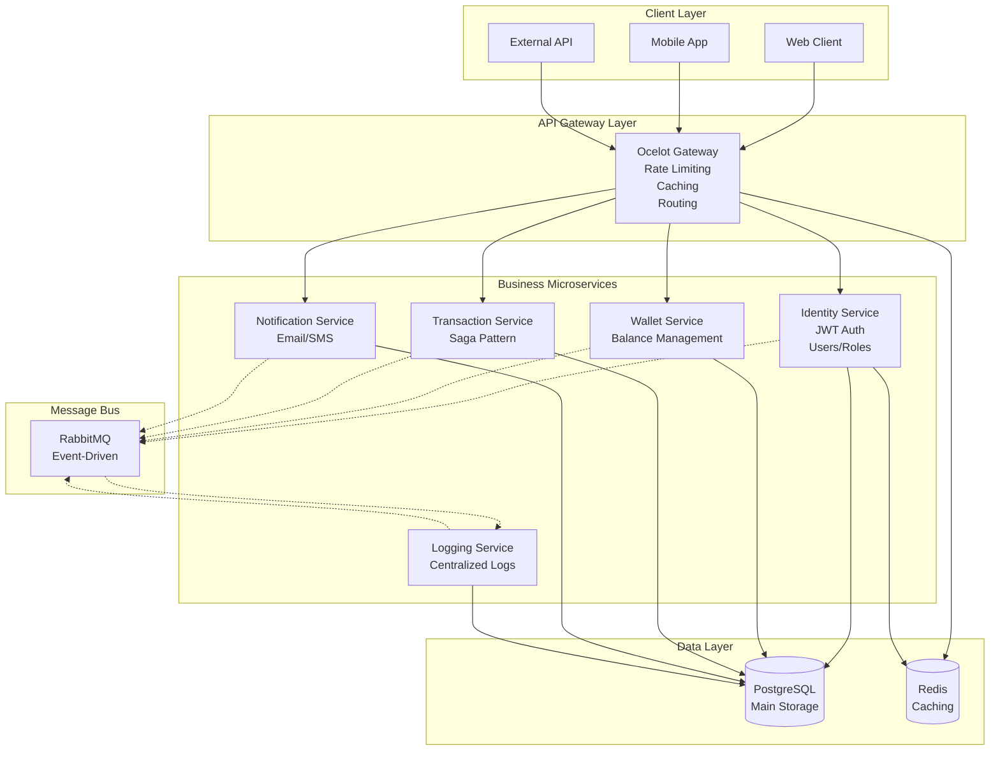
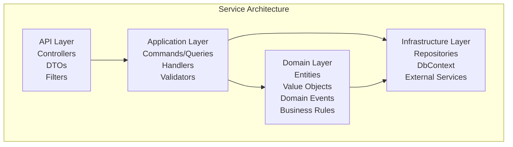

# 🚀 NexusPay - Distributed Payment Microservices Platform

**Enterprise-grade distributed payment system built with cutting-edge .NET technologies**

## 📖 Overview

NexusPay is a sophisticated microservices-based payment platform that demonstrates enterprise-level architecture patterns and modern software development practices. The system handles user management, wallet operations, financial transactions, and real-time notifications with high reliability and scalability.

## 🏗️ System Architecture

### 🔄 Microservices Ecosystem

# 🛠️ Technology Stack

## 🎯 Core Framework
- **.NET 8.0** - Cross-platform runtime
- **ASP.NET Core 8** - Modern web framework  
- **C# 13** - Latest language features
- **Entity Framework Core 8** - High-performance ORM

## 🏗️ Architecture Patterns
- **Domain-Driven Design (DDD)** - Strategic and tactical patterns
- **Clean Architecture** - Separation of concerns
- **CQRS** - Command Query Responsibility Segregation
- **Mediator Pattern** - In-process messaging with MediatR
- **Saga Pattern** - Distributed transactions management
- **Event-Driven Architecture** - Loose coupling through events

## 🗄️ Data & Storage
- **PostgreSQL** - Primary relational database
- **Redis** - Distributed caching & session storage
- **EF Core Migrations** - Database versioning and schema management

## 🔗 Communication & Integration
- **RabbitMQ** - Message broker for event-driven communication
- **Ocelot API Gateway** - Unified API entry point with routing
- **RESTful APIs** - Standardized web services
- **JWT Bearer Tokens** - Stateless authentication

## 📦 Libraries & Tools
- **MediatR** - CQRS pattern implementation
- **FluentValidation** - Comprehensive request validation
- **AutoMapper** - Object-to-object mapping
- **Swagger/OpenAPI** - API documentation
- **Serilog** - Structured logging

## 🐳 Containerization & DevOps
- **Docker** - Containerization platform
- **Docker Compose** - Multi-container orchestration
- **Health Checks** - Service monitoring

# 📋 Microservices Overview

## 🔐 Identity Service (`identity-service`)
**Responsibilities:** User management, authentication, authorization
- **JWT Token** generation and validation
- **Role-based access control** (RBAC)
- **User registration** with email confirmation
- **Password hashing** and security
- **Refresh token** mechanism

## 💰 Wallet Service (`wallet-service`)
**Responsibilities:** Balance management, fund operations
- **Wallet creation** and management
- **Balance operations** (deposit, withdrawal)
- **Fund reservation** for transactions
- **Balance validation** and business rules

## 🔄 Transaction Service (`transaction-service`)
**Responsibilities:** Payment processing, money transfers
- **Saga Pattern** for distributed transactions
- **Transaction state management** (Pending, Completed, Failed)
- **Compensating actions** for rollbacks
- **Event sourcing** for audit trails

## 📧 Notification Service (`notification-service`)
**Responsibilities:** User communications, alerts
- **Email notifications** (SMTP integration)
- **SMS messaging** (Twilio integration)
- **Template management** for messages
- **Notification scheduling**

## 📊 Logging Service (`logging-service`)
**Responsibilities:** Centralized logging, audit trails
- **Structured logging** from all services
- **Log aggregation** and storage
- **Audit trail** for compliance
- **Performance monitoring**

## 🚪 API Gateway (`api-gateway`)
**Responsibilities:** Unified API entry point
- **Request routing** and aggregation
- **Rate limiting** and throttling
- **Response caching**
- **Load balancing**

# 🚀 Key Features

## 💳 Payment Processing
- **Secure money transfers** between users
- **Transaction history** with full audit trail
- **Balance validation** and fund reservation
- **Saga-based** distributed transaction management

## 🔐 Security & Auth
- **JWT-based authentication** with refresh tokens
- **Role-based authorization** with fine-grained permissions
- **Password policies** and secure hashing
- **Email confirmation** with 4-digit codes

## 📡 Event-Driven Communication
- **RabbitMQ message broker** for inter-service communication
- **Domain events** for business process coordination
- **Event handlers** for side effects and integrations
- **Event sourcing** for critical business processes

## 🏗️ Scalability & Resilience
- **Microservices architecture** for independent scaling
- **Database per service** pattern for data isolation
- **Circuit breaker** patterns for fault tolerance
- **Health checks** and monitoring

# 🏃‍♂️ Getting Started

## Prerequisites
- **.NET 8.0 SDK**
- **Docker & Docker Compose**
- **PostgreSQL 16+**
- **Redis 7+**
- **RabbitMQ 3.12+**
